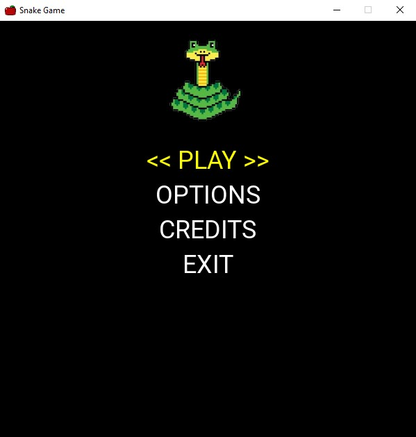
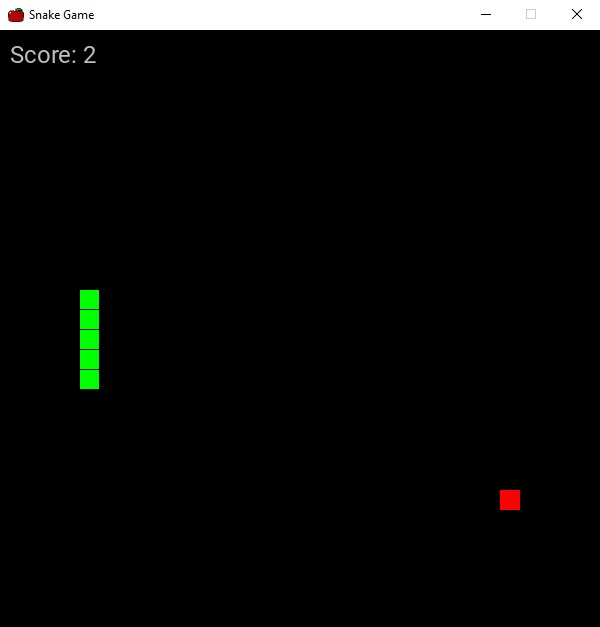

# Snake Game feito com Python e Pygame

## Tela inicial do Jogo:

---

### A tela inicial do jogo é compostar por 4 itens:
- PLAY
- OPTIONS
- CREDITS
- EXIT

--- 

### O `play` inicia o jogo da snake:

### O `options` abre as configurações do jogo:

    em breve ⏱

### O `credits` mostra os créditos ao criador do jogo:

    em breve ⏲

### O `exit` apenas fecha o programa.
